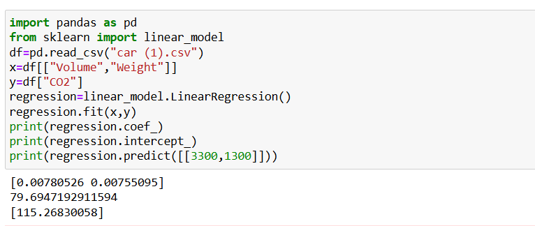

# Implementation of Multivariate Linear Regression
## Aim
To write a python program to implement multivariate linear regression and predict the output.
## Equipment’s required:
1.	Hardware – PCs
2.	Anaconda – Python 3.7 Installation / Moodle-Code Runner
## Algorithm:
### Step1
    Normal Equation (no iteration)

### Step2
    Batch Gradient Descent

### Step3
    Stochastic Gradient Descent

### Step4
    Mini-Batch Gradient Descent

### Step5
    Gradient Descent with Feature Scaling
## Program:
```python
Developed by: Siddharth CM
Register number: 212225040413
import pandas as pd
from sklearn import linear_model
df=pd.read_csv("car (1).csv")
x=df[["Volume","Weight"]]
y=df["CO2"]
regression=linear_model.LinearRegression()
regression.fit(x,y)
print(regression.coef_)
print(regression.intercept_)
print(regression.predict([[3300,1300]]))

```
## Output:

### Insert your output


## Result
Thus the multivariate linear regression is implemented and predicted the output using python program.